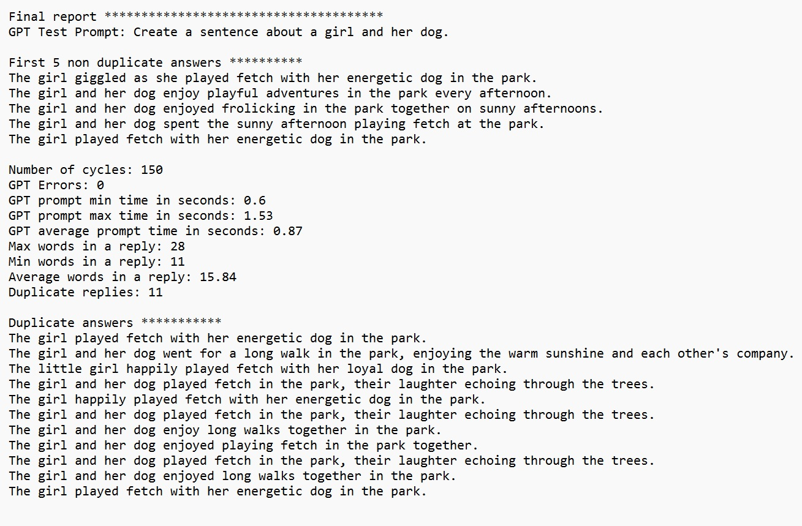

# AI Probe
Docs 9-9-23 V1 (For questions or comments:  Stephen Witty switty@level500.com)  

### Project Overview:
This project gathers statistics related to GPT.  GPT is asked to create a sentence with few details.  The same prompt was used 150 times and results were measured.  Among other things, the number of times the same reply was given by GPT was recorded.

### Usage:

- The software is a Python3 script and runs in the usual manner
- There is only one source code/script file
- A user must first install the OpenAI Python API (Google for instructions)
- User must enter their OpenAI API key toward the top of the Python script
- The GPT model can be selected in the source file
- Under Constants - assign the number of times for the prompt to run